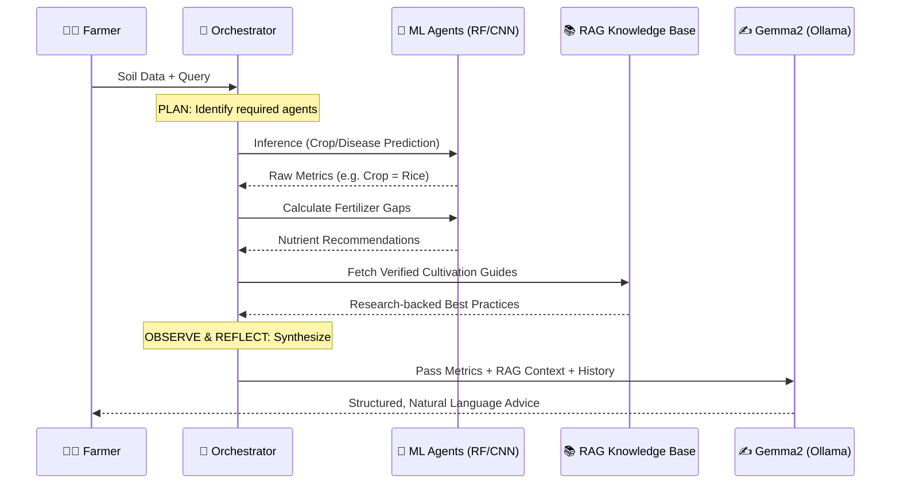

<div align="center">


# 🌾 Krishi Mitr
### *The Farmer's Friend — Agentic AI Smart Farming Ecosystem*


<br/>

[](https://github.com/itsshaliniS/Agro)
[](https://github.com/itsshaliniS/Agro)
[](https://ollama.com)
[](https://flask.palletsprojects.com)
[](https://python.org)
[](LICENSE)

<br/>

> **Empowering Indian farmers with precision agriculture, AI-driven crop insights, and real-time market intelligence — entirely offline, entirely local.**

</div>

## 📋 Table of Contents

- [Overview](#-overview)
- [Architecture & AI Stack](#-architecture--ai-stack)
- [The Agentic Squad](#-the-agentic-squad)
- [P.A.O.R Loop](#-paor-intelligent-workflow-loop)
- [Key Features](#-key-features)
- [Tech Stack](#-tech-stack)
- [Project Structure](#-project-structure)
- [Installation & Quick Start](#-installation--quick-start)
- [Roadmap](#-roadmap)
- [Contributing](#-contributing)
- [License](#-license)

---

## 🌟 Overview

**Krishi Mitr** (Sanskrit: *कृषि मित्र*, meaning "Farmer's Friend") is a state-of-the-art **Agentic AI** ecosystem designed to bridge the gap between advanced agricultural science and grassroots farming across India.

By leveraging a multi-agent orchestration layer, **Retrieval-Augmented Generation (RAG)**, and fully local Ollama models, Krishi Mitr delivers highly personalized, reasoned, and data-backed strategies for precision agriculture — with **zero dependency on cloud APIs** for its core intelligence.

### ✨ What Makes It Different

| Capability | Traditional Apps | Krishi Mitr |
|:---|:---:|:---:|
| Works Offline | ❌ | ✅ Full local LLM |
| Multi-Agent Reasoning | ❌ | ✅ 8 specialized agents |
| RAG Knowledge Grounding | ❌ | ✅ 14+ verified guides |
| Disease Detection via Image | ❌ | ✅ 38 diseases, 99.21% acc |
| Live Market Prices | ❌ | ✅ data.gov.in integration |
| Crop Yield Forecasting | ❌ | ✅ XGBoost regressor |

---

## 🧠 Architecture & AI Stack

Krishi Mitr runs a **completely local AI pipeline** — no API calls, no data leakage, no cloud dependency for core reasoning.

```
 User Query
     │
     ▼
┌──────────────────────────────────────────────┐
│             Orchestrator (orchestrator.py)    │
│   Plan → Dispatch → Observe → Reflect        │
└──────┬───────────────────────────────────────┘
       │
   ┌───┼────────────────────────┐
   ▼   ▼                        ▼
ML Agents              RAG Pipeline (ChromaDB)
(RF/CNN/XGB)           ├── nomic-embed-text
                       └── gemma2:2b (Ollama)
```

### Local RAG Components

| Component | Technology | Details |
|:---|:---|:---|
| **LLM** | `ollama/gemma2:2b` | 2B-param model, GTX 1650 Ti optimized |
| **Embeddings** | `nomic-embed-text` | Local semantic vectorization |
| **Vector Store** | ChromaDB / FAISS | Fast similarity retrieval |
| **Knowledge Base** | 14+ domain guides | Verified agri-research documents |
| **Built-in Tools** | NPK Calc + Weather | Bypass RAG for common queries |

### How RAG Works

```
1. 📄 Ingest      → Documents from app/chatbot_docs/ split into chunks
2. 🔢 Embed       → Each chunk vectorized via Ollama nomic-embed-text
3. 🗄️ Store       → Vectors persisted in ChromaDB
4. 🔍 Retrieve    → Top-3 relevant chunks fetched per user query
5. 🧠 Synthesize  → Gemma2 generates grounded, natural language answer
6. 🔧 Tool Use    → NPK/weather queries bypass RAG for speed
```

---

## 🤖 The Agentic Squad

Eight specialized AI agents, each an expert in its domain:

| Agent | Primary Goal | Intelligence Model | Accuracy |
|:---|:---|:---|:---:|
| 🌱 **Crop Advisor** | Recommend optimal crops by soil & climate | Random Forest | **99.09%** |
| 🔬 **Plant Pathologist** | Diagnose 38 leaf diseases from a photo | ResNet9 CNN | **99.21%** |
| 🧪 **Nutrient Lab** | Analyze deficiencies & plan fertilizer | Expert Rule Engine | — |
| 📊 **Precision Yield** | Forecast harvest output per hectare | XGBoost / RF Regressor | — |
| 🌿 **Sustain Master** | Plan crop rotation & long-term soil health | Sustainability Scoring Engine | — |
| 💧 **Hydration Agent** | Optimize irrigation for water efficiency | ML-driven Hydration Predictor | — |
| 📈 **Market Analyst** | Real-time mandi prices + sell/hold advice | data.gov.in API | — |
| 🤖 **Agri-Bot (RAG)** | Answer complex queries via verified research | Ollama Gemma2 + ChromaDB | — |

---

## 🔄 P.A.O.R Intelligent Workflow Loop

Every piece of advice follows the **Plan → Act → Observe → Reflect** loop:



---

## 🎨 Key Features

### 🌱 Smart Farming Core

- **Crop Recommendation** — Input soil NPK, pH, rainfall, temperature & humidity to get AI-ranked crop suggestions
- **Disease Detection** — Upload any leaf photo for instant diagnosis across 38+ plant diseases with 99.21% accuracy
- **Fertilizer Advisor** — Personalized nutrient management plans based on crop type and current soil deficiencies
- **Irrigation Scheduler** — AI-driven watering schedules optimized per crop variety and local weather conditions
- **Yield Predictor** — Forecast expected harvest yields using historical data and real-time environmental inputs

### 📊 Market & Weather Intelligence

- **Live Mandi Prices** — Real-time market rates from [data.gov.in](https://data.gov.in) with AI-generated sell/hold recommendations
- **Weather Integration** — Hyper-local climate data via OpenWeatherMap API
- **Agri News Feed** — Curated agricultural news, policy updates, and scheme alerts

### 🌿 Sustainable Farming

- **Crop Rotation Planner** — Long-term soil health strategies based on crop history
- **Sustainability Score** — Quantified eco-impact tracking for farming practices
- **Water Conservation** — Precision irrigation reduces water waste

### 📱 User Experience

- **Glassmorphism UI** — Premium, responsive frontend with modern glass-effect design
- **Interactive Dashboard** — Real-time farm data visualizations
- **Mobile-First** — Optimized for use on low-cost Android devices in the field
- **Case Studies** — Real farmer success stories from across India

---

## 🛠️ Tech Stack

| Layer | Technologies |
|:---|:---|
| **Backend** | Flask, Python 3.10+, Gunicorn |
| **Local LLM & RAG** | Ollama (`gemma2:2b`, `nomic-embed-text`), LangChain, ChromaDB, FAISS |
| **Machine Learning** | scikit-learn, XGBoost, PyTorch, TorchVision |
| **Data Processing** | NumPy, Pandas |
| **Visualization** | Matplotlib, Seaborn |
| **Database** | MongoDB |
| **Authentication** | Auth0 |
| **APIs** | OpenWeatherMap, data.gov.in Market API |
| **Dev Tools** | Jupyter Notebooks |

---

## 📁 Project Structure

```
Krishi-Mitr/
├── app/
│   ├── agents/
│   │   ├── crop_agent.py
│   │   ├── disease_agent.py
│   │   ├── fertilizer_agent.py
│   │   ├── irrigation_agent.py
│   │   ├── sustainability_agent.py
│   │   └── yield_agent.py
│   ├── static/
│   │   ├── css/
│   │   ├── images/          ← Tractor.svg lives here
│   │   └── scripts/
│   ├── templates/
│   ├── utils/
│   ├── chatbot_docs/        ← RAG knowledge base (14+ guides)
│   ├── Data/
│   ├── app.py
│   ├── auth.py
│   ├── config.py
│   ├── orchestrator.py      ← P.A.O.R. engine
│   └── models_registry.py
├── notebooks/
├── docs/
├── scripts/
├── tests/
├── .env.example
├── requirements.txt
├── Contributing.md
├── LICENSE
└── README.md
```

---

## 💻 Installation & Quick Start

### Prerequisites

- Python **3.10+**
- Git
- **Ollama** — [Download here](https://ollama.com/)
- NVIDIA GPU recommended (GTX 1650 Ti or better, 4GB+ VRAM)

### Step 1 — Clone the Repository

```bash
git clone https://github.com/itsshaliniS/Agro.git
cd Agro
```

### Step 2 — Set Up Ollama (Local AI)

```bash
ollama pull gemma2:2b
ollama pull nomic-embed-text
ollama list
```

### Step 3 — Create Virtual Environment

**Windows:**
```powershell
python -m venv .venv
.\.venv\Scripts\Activate.ps1
pip install -r requirements.txt
```

**Linux / macOS:**
```bash
python -m venv .venv
source .venv/bin/activate
pip install -r requirements.txt
```

### Step 4 — Configure Environment Variables

```bash
cp .env.example .env
```

```env
OPENAI_API_KEY=your_openai_key_here
WEATHER_API_KEY=your_openweathermap_key_here
GEMINI_API_KEY=your_gemini_key_here
MARKET_API_KEY=your_data_gov_in_api_key_here
MARKET_API_RESOURCE_ID=your_market_resource_id_here
FLASK_SECRET_KEY=your_flask_secret_key_here
AUTH0_SECRET=your_auth0_secret_here
AUTH0_CLIENT_ID=your_auth0_client_id_here
AUTH0_CLIENT_SECRET=your_auth0_client_secret_here
AUTH0_DOMAIN=your_auth0_domain_here
```

> **Note:** The core RAG chatbot and all ML agents work fully offline. Only market prices and weather features require API keys.

### Step 5 — Launch

```bash
cd app
python app.py
```

Open **http://localhost:5000** 🌾

---

## 🗺️ Roadmap

| Priority | Feature | Status |
|:---:|:---|:---:|
| 🔥 | **Multilingual Support** via Bhashini API | Planned |
| 🔥 | **Mobile App** — Native Android/iOS | Planned |
| 🟡 | **IoT Integration** — Live soil sensors | Planned |
| 🟡 | **Offline Mode** — Lite quantized models | Planned |
| 🟢 | **Marketplace** — Direct vendor links | Planned |
| 🟢 | **Drone Integration** — Aerial monitoring | Planned |
| 🟢 | **Farmer Community** — Knowledge sharing | Planned |

---

## 🤝 Contributing

```bash
git checkout -b feature/AmazingFeature
git commit -m 'Add AmazingFeature'
git push origin feature/AmazingFeature
# Open a Pull Request
```

Please read [Contributing.md](Contributing.md) for our code of conduct and PR guidelines.

---

## 🛡️ License

Licensed under the **GNU General Public License v3.0** — see [LICENSE](LICENSE) for details.

---

## 🙏 Acknowledgments

- The farmers of India, whose feedback shaped every feature
- The agricultural research community and open-source ML contributors
- The Ollama team for making local LLM deployment accessible

<div align="center">

**Built with ❤️ for the Indian Farmer**

*Empowering agriculture through AI, data science, and local intelligence*

</div>
