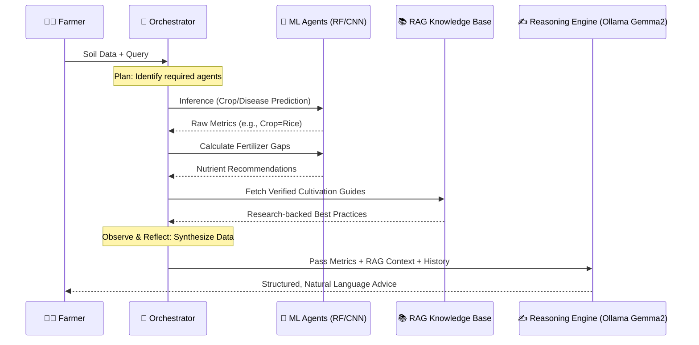

# Krishi Mitr: Agentic AI Smart Farming Ecosystem

<div align="center">
  <!-- Tractor Animation Logo (Lottie) -->
  <!-- Replace the src URL with your actual repo's raw URL if different! -->
  <lottie-player
    src="https://raw.githubusercontent.com/itsshaliniS/Agro/main/app/static/images/Tractor.json"
    background="transparent"
    speed="1.2"
    style="width: 250px; height: 250px;"
    loop
    autoplay>
  </lottie-player>


  <br><br>

  
  
  
  
  
  
</div>

<!-- Load Lottie Web Player -->
<script src="https://unpkg.com/@lottiefiles/lottie-player@latest/dist/lottie-player.js"></script>

---

## 📋 Table of Contents
- [Overview](#-overview)
- [The Agentic Squad](#-the-agentic-squad-specialized-ai-agents)
- [Key Features](#-key-features)
- [Tech Stack](#-tech-stack)
- [Project Structure](#-project-structure)
- [Installation & Setup](#-installation--quick-start)
- [Contributing](#-contributing)
- [License](#-license)

---

## 🌟 Overview

**Krishi Mitr** (The Farmer's Friend) is a state-of-the-art **Agentic AI** ecosystem designed to bridge the gap between advanced agricultural science and grassroots farming. By leveraging a multi-agent orchestration layer and **Retrieval-Augmented Generation (RAG)** with local Ollama models, Krishi Mitr provides highly personalized, reasoned, and data-backed strategies for precision agriculture.

### Key Highlights:
- 🔧 **Local AI with Ollama**: Runs entirely offline using Ollama's Gemma2 model (2B parameters) + Nomic embeddings (4GB GPU optimized for GTX 1650 Ti)
- 📚 **RAG with Tools**: Integrated vector store (Chroma/FAISS) for grounded answers from verified agricultural guides, plus built-in tools for NPK calculations & real-time weather
- 🤖 **Multi-Agent Orchestration**: 6 specialized AI agents working autonomously
- 🎨 **Glassmorphism UI**: Modern, responsive frontend

This comprehensive platform empowers farmers with:
- AI-driven crop recommendations
- Real-time plant disease detection
- Smart fertilizer management
- Precision irrigation scheduling
- Yield prediction and optimization
- Sustainable farming practices
- Live market trends analysis
- Weather intelligence

---

## 🧠 Local AI Stack: RAG + Ollama + Tools

Krishi Mitr features a completely local AI pipeline powered by Ollama, eliminating any reliance on cloud LLMs for core chat functionality.

| Component | Technology | Details |
|-----------|------------|---------|
| **LLM** | Ollama `gemma2:2b` | 2B‑parameter model optimized for GTX 1650 Ti (4GB VRAM) |
| **Embeddings** | Ollama `nomic-embed-text` | Local semantic embeddings for RAG |
| **Vector Store** | ChromaDB / FAISS | Persistent vector index for fast retrieval |
| **Built‑in Tools** | NPK Calculator, Weather Fetcher | Dedicated tools for direct answers to common farming queries |
| **Knowledge Base** | 14+ domain‑specific guides | Verified agricultural research & system information |

### How Local RAG Works:
1. **Ingestion**: Documents from `app/chatbot_docs/` are split into chunks
2. **Embedding**: Each chunk is vectorized using Ollama embeddings
3. **Storage**: Vectors are stored in ChromaDB for fast similarity search
4. **Retrieval**: For a user query, top‑3 relevant chunks are fetched
5. **Synthesis**: Gemma2 generates grounded answers using the retrieved context
6. **Tool Integration**: Direct answers for NPK/weather queries bypass RAG for speed

---

## 🤖 The Agentic Squad (Specialized AI Agents)

Our system is powered by a team of specialized AI agents, each an expert in its domain.

| 🧙‍♂️ Agent | 🎯 Primary Goal | 🧠 Model Intelligence |
| :--- | :--- | :--- |
| **Crop Advisor** | Recommend optimal crops based on soil & climate. | **Random Forest (99.09% Acc)** |
| **Plant Pathologist** | Diagnose 38 leaf diseases from a single photo. | **ResNet9 CNN (99.21% Acc)** |
| **Nutrient Lab** | Analyze deficiencies and suggest fertilizer plans. | **Expert Rule Engine + CSV Logic** |
| **Precision Yield** | Forecast expected harvest output per hectare. | **XGBoost / RF Regressor** |
| **Sustain Master** | Plan crop rotation & long-term soil health. | **Sustainability Scoring Engine** |
| **Hydration Agent** | Optimize irrigation schedules for water efficiency. | **ML-driven Hydration Predictor** |
| **Market Analyst** | Real-time mandi prices and sell/hold advice. | **Data.gov.in API Integration** |
| **Agri-Bot (RAG)** | Answer complex queries via verified research. | **Ollama Gemma2 (2B) + ChromaDB** |

---

## 🔄 Intelligent Workflow (P.A.O.R Loop)

Krishi Mitr utilizes the **Plan-Act-Observe-Reflect** loop to ensure every piece of advice is contextually accurate.



---

## 🎨 Key Features

### 🌱 Smart Farming Solutions
- **Crop Recommendation**: Input soil NPK, pH, rainfall, temperature, and humidity to get optimal crop suggestions
- **Disease Detection**: Upload plant leaf images for instant diagnosis of 38+ diseases
- **Fertilizer Advisor**: Get personalized nutrient management plans based on crop and current soil health
- **Irrigation Scheduler**: AI-driven watering plans optimized for crop and weather conditions
- **Yield Predictor**: Forecast harvest yields using historical and real-time data

### 📊 Market & Weather Intelligence
- **Live Market Trends**: Real-time mandi prices from data.gov.in with sell/hold recommendations
- **Weather Updates**: Integrated weather API for local climate conditions
- **Agri News Feed**: Curated agricultural news and policy updates

### 🎯 Sustainable Farming
- **Crop Rotation Planner**: Long-term soil health management strategies
- **Sustainability Score**: Track eco-friendly farming practices
- **Water Conservation**: Optimized irrigation to reduce water waste

### 📱 User Experience
- **Premium Glassmorphism UI**: Modern, intuitive interface
- **Responsive Design**: Works seamlessly on desktop and mobile
- **Interactive Dashboard**: Real-time visualizations of farm data
- **Case Studies**: Real farmer success stories

---

## 🛠️ Tech Stack

| Category | Technologies |
| :--- | :--- |
| **Backend** | Flask, Python 3.10+ |
| **Local LLM & RAG** | Ollama, LangChain, ChromaDB, FAISS |
| **Machine Learning** | scikit-learn, XGBoost, PyTorch, TorchVision |
| **Data Processing** | NumPy, Pandas |
| **Visualization** | Matplotlib, Seaborn |
| **Database** | MongoDB |
| **Authentication** | Auth0 |
| **APIs** | OpenAI API, OpenWeatherMap API, data.gov.in Market API |
| **Deployment** | Gunicorn |
| **Development** | Jupyter Notebooks |

---

## 📁 Project Structure

```
Krishi-Mitr/
├── app/                          # Core Flask Application
│   ├── agents/                   # Multi-agent logic (Crop, Disease, etc.)
│   │   ├── crop_agent.py
│   │   ├── disease_agent.py
│   │   ├── fertilizer_agent.py
│   │   ├── irrigation_agent.py
│   │   ├── sustainability_agent.py
│   │   └── yield_agent.py
│   ├── static/                   # Premium CSS (Glassmorphism) & JS
│   │   ├── css/
│   │   ├── images/
│   │   └── scripts/
│   ├── templates/                # HTML Templates
│   ├── utils/                    # Database & Inference helpers
│   ├── chatbot_docs/             # RAG knowledge base documents
│   ├── Data/                     # Datasets (fertilizer.csv, etc.)
│   ├── app.py                    # Main Flask app entry point
│   ├── auth.py                   # Authentication setup
│   ├── config.py                 # Configuration
│   ├── orchestrator.py           # Agent orchestration layer
│   └── models_registry.py        # ML model registry
├── notebooks/                    # Training & Evaluation Notebooks
│   ├── Crop_Recommendation_Model.ipynb
│   ├── plant-disease-classification-resnet-99-2.ipynb
│   └── ...
├── docs/                         # Technical Design & Workflow Docs
├── scripts/                      # Audit & Verification Scripts
├── tests/                        # Unit and integration tests
├── .env.example                  # Environment variables example
├── .gitignore
├── requirements.txt              # Python dependencies
├── Contributing.md
├── LICENSE
└── README.md                     # This file
```

---

## 💻 Installation & Quick Start

### Prerequisites
- Python 3.10 or higher
- Git
- **Ollama** (for local LLM & RAG) - [Download Ollama](https://ollama.com/)

### Step 1: Clone the Repository
```bash
git clone https://github.com/itsshaliniS/Agro.git
cd Agro
```

### Step 2: Set Up Ollama (Local AI)
1. Install Ollama from [ollama.com](https://ollama.com/)
2. Pull the required models:
   ```bash
   ollama pull gemma2:2b
   ollama pull nomic-embed-text
   ```
3. Verify Ollama is running:
   ```bash
   ollama list
   ```

### Step 3: Environment Setup
Create and activate a virtual environment:

**Windows (PowerShell):**
```bash
python -m venv .venv
.\.venv\Scripts\Activate.ps1
pip install -r requirements.txt
```

**Linux/MacOS:**
```bash
python -m venv .venv
source .venv/bin/activate
pip install -r requirements.txt
```

### Step 4: Configure Environment Variables
Copy `.env.example` to `.env` and fill in your API keys:

```bash
cp .env.example .env
```

Edit `.env` with your credentials:
```env
# API Keys (Optional for local RAG chatbot)
OPENAI_API_KEY=your_openai_key_here
WEATHER_API_KEY=your_openweathermap_key_here
GEMINI_API_KEY=your_gemini_key_here
MARKET_API_KEY=your_data_gov_in_api_key_here
MARKET_API_RESOURCE_ID=your_market_resource_id_here

# Flask Configuration
FLASK_SECRET_KEY=your_flask_secret_key_here

# Auth0 Configuration (Optional)
AUTH0_SECRET=your_auth0_secret_here
AUTH0_CLIENT_ID=your_auth0_client_id_here
AUTH0_CLIENT_SECRET=your_auth0_client_secret_here
AUTH0_DOMAIN=your_auth0_domain_here
```

### Step 5: Run the Application
```bash
cd app
python app.py
```

The application will start at `http://localhost:5000`

---

## 🤝 Contributing

We welcome contributions to Krishi Mitr! Here's how you can help:

1. Fork the repository
2. Create a feature branch (`git checkout -b feature/AmazingFeature`)
3. Commit your changes (`git commit -m 'Add some AmazingFeature'`)
4. Push to the branch (`git push origin feature/AmazingFeature`)
5. Open a Pull Request

Please read [Contributing.md](Contributing.md) for details on our code of conduct and the pull request process.

---

## 🗺️ Future Roadmap

- [ ] **Multilingual Support**: Integration of Bhashini API for regional Indian languages
- [ ] **IoT Integration**: Live telemetry from soil moisture and NPK sensors
- [ ] **Mobile App**: Native Android/iOS applications
- [ ] **Marketplace**: Direct link to seed and fertilizer vendors based on AI advice
- [ ] **Offline Mode**: Lite models for areas with low connectivity
- [ ] **Farmer Community**: Social features for knowledge sharing
- [ ] **Drone Integration**: Aerial crop health monitoring

---

## 🛡️ License

This project is licensed under the GNU General Public License v3.0 - see the [LICENSE](LICENSE) file for details.

---

## 🙏 Acknowledgments

- All the farmers who provided valuable feedback
- The agricultural research community
- Open-source contributors

---

<div align="center">
  <b>Built with ❤️ for the Indian Farmer</b><br>
  <i>Empowering agriculture through AI and data science</i>
</div>
